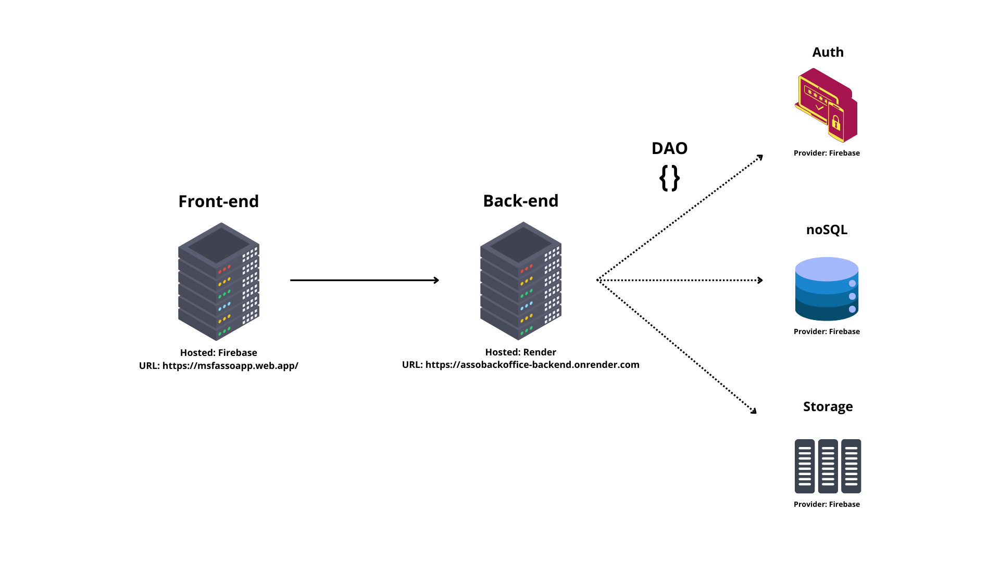

# AssoBackOffice-Backend

### Objetivo

Esse software tem como objetivo ser uma API que gerencia o banco de dados e cria respostas para o AssoApp - FrontEnd.
O AssoApp é uma ferramenta desenvolvida para cadastrar e gerenciar associados na base de dados do departamento associativo. Além disso, também irá ajudar na gestão de presença desses associados em eventos e no pagamento das anuidades da associação.

### Arquitetura

O projeto em ambiente de homologação tem a arquitetura dividida em cinco partes, conforme descrito na imagem acima.

O frontend está hosteado na `Firebase` e pode ser acessado através do link: https://msfassoapp.web.app/

O backend está hosteado no `Render` e pode ser acessado através do link: https://assobackoffice-backend.onrender.com

Os serviços de autentificação, banco de dados e storage estão sendo fornecidos pela `Firebase` e são acessados diretamente pelo SDK de cliente que roda no bancked. Isso deverá ter que ser refeito eventualmente para que o SDK que rode no servidor seja o Admin.

Para mais documentação acesse [docs/index](./docs/Index.md)
