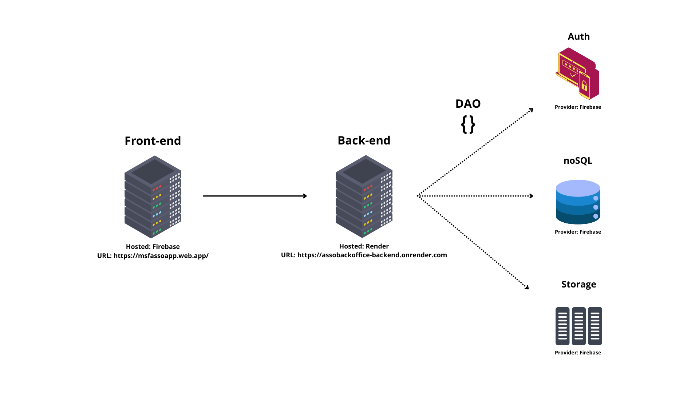

## Bem vindo a documentação de AssoApp - BackEnd

### Objetivo

Esse software tem como objetivo ser uma API que gerencia o banco de dados e cria respostas para o AssoApp - FrontEnd.
O AssoApp é uma ferramenta desenvolvida para cadastrar e gerenciar associados na base de dados do departamento associativo. Além disso, também irá ajudar na gestão de presença desses associados em eventos e no pagamento das anuidades da associação.

### Arquitetura



O projeto em ambiente de homologação tem a arquitetura dividida em cinco partes, conforme descrito na imagem acima.

O frontend está hosteado na `Firebase` e pode ser acessado através do link: https://msfassoapp.web.app/

O backend está hosteado no `Render` e pode ser acessado através do link: https://assobackoffice-backend.onrender.com

Os serviços de autentificação, banco de dados e storage estão sendo fornecidos pela `Firebase` e são acessados diretamente pelo SDK de cliente que roda no backend. Isso deverá ter que ser refeito eventualmente para que o SDK que rode no servidor seja o Admin.

### Estrutura de pastas

Esse projeto foi construído com a intenção de criar portas e adaptadores entre o domínio (segundo o conceito de DDD) e as ferramentas de manipulação de dados. Isso significa que o domínio foi abstraído em modelos, tipos e objetos de acesso aos dados. Todas as interações com o domínio se darão através dos DAO (data acess object).

A estrutura de pastas seguida tem como objetivo separar os componentes que se conectam aos serviços e o conteúdo abstraído.

- [application](./application.md) // é repositório do serviço aplicado vindo da infraestrutura
- [domain](./domain.md) // é repositório das abstrações do domínio e seus respectivos objetos de acesso
- [infraestucture](./infraestructure.md) // é repositório de informações sobre serviços externos como a FireBase
- [routes](./routes.md) // é repositório das rotas de acesso da aplicação

A intenção é criar uma aplicação que é logicamente fechada em si mesmo, completamente desacoplada dos serviços. Para isso, todo DAO recebe como parâmetro de criação um objeto de controle do repositório. Esse objeto é composto de funções templates, como por exemplo `read`, `delete`, etc. Dessa forma é possível facilmente substituir o serviço, basta criar um novo objeto que respeite os parâmetros do DAO.

### Rodando a aplicação

Primeiro execute o comando:

```
npm install
```

Para instalar as dependências da aplicação. Em seguida execute o comando:

```
npx tsx index.ts
```

### Links importantes e dependências

- [Express](https://expressjs.com/) - framework para criação de web apps
- [Express validator](https://express-validator.github.io/docs/) - middleware de validação de campos para rotas
- [Firebase](https://firebase.google.com/docs/) - documentação para os serviços de autenticação, repositório de imagens e banco de dados NoSQL
- [Multer](https://github.com/expressjs/multer) - middleware para upload de arquivos
